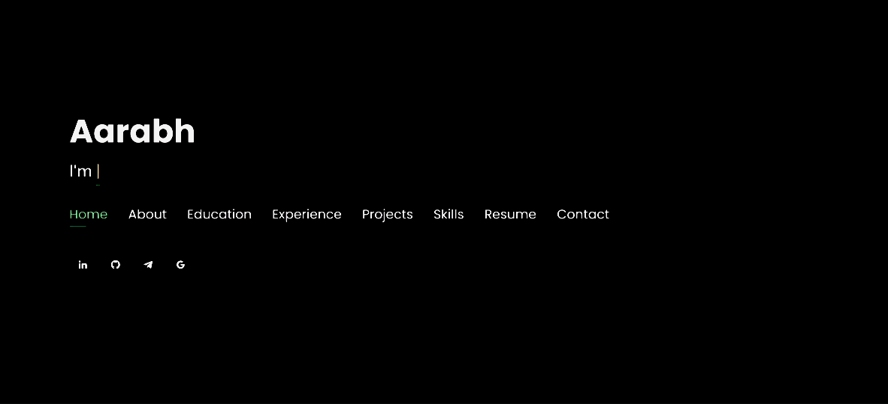
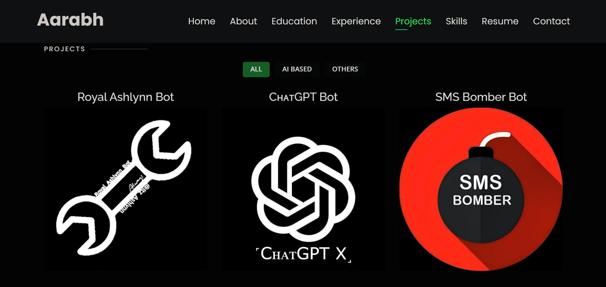

# Personal Portfolio ⚡️ 
> A clean, beautiful, responsive portfolio template for CA Student!

> Just kidding anyone can use it!

:star: Star me on GitHub — it helps!

> [click here to see](https://itz-ashlynn.github.io/Personal_portfolio/)

 

[](https://github.com/Itz-Ashlynn/Personal_portfolio/commits/master)
[](http://itz-ashlynn.github.io/Personal_portfolio/)
[](https://www.linkedin.com/in/aarabh/)
[](http://badges.mit-license.org)

### Website Preview
#### Home Page



#### About Page


#### Project Page

  


:star: Star me on GitHub — it helps!

## Features 📋
⚡️ Fully Responsive\
⚡️ Valid HTML5 & CSS3\
⚡️ Typing animation using `Typed.js`\
⚡️ Easy to modify

## Installation & Deployment 📦
- Clone the repository and modify the content of <b>index.html</b> 
- Add or remove images from `assets/img/` directory as per your requirement.
- Update the info of `projects` folder according to your need
- Update the Home page typed animated line{`a Passionate CA Student`} in <b>index.html</b> at bottom.
- Use [Github Pages](https://create-react-app.dev/docs/deployment/#github-pages) to create your own website.
- To deploy your website, first you need to create github repository with name `<your-github-username>.github.io` and push the generated code to the `master` branch.

## Sections 📚
✔️ About\
✔️ Interests\
✔️ Education\
✔️ Online Certification\
✔️ Experience\
✔️ Projects \
✔️ Skills \
✔️ Resume\
✔️ Contact Info


## Tools Used 🛠️
* <b>GitHub Pages</b> - To host my static website (HTML, CSS, JS).

## Need help?

```

  if (needHelp === true) {
     var emailId = "aarabhofficial@gmail.com";
     // email is the best way to reach out to me.
     sendEmail(emailId);
  }

```

## License
[](http://badges.mit-license.org)

- **[MIT license](http://opensource.org/licenses/mit-license.php)**

